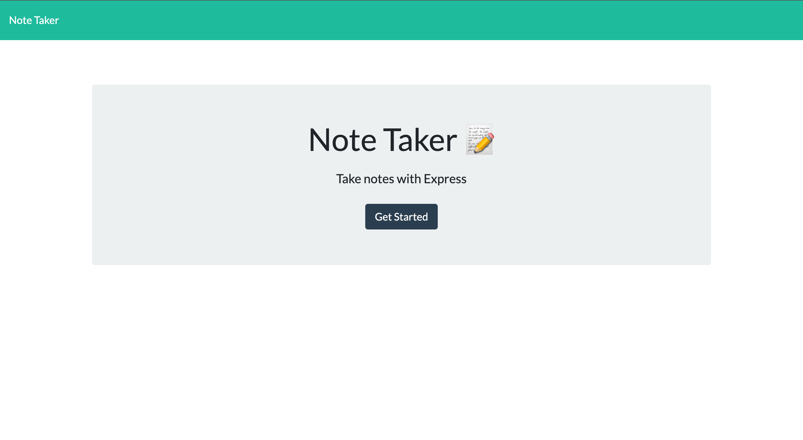
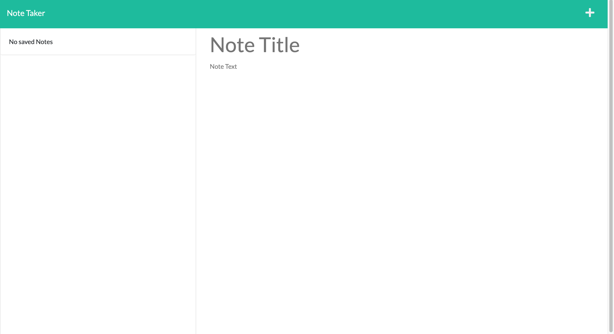

# Note Taker 

## Description 📖 
This application allows you to write notes and save notes.

## Table of Contents 
  1. [Installation](#installation)
  2. [Built With](#built-with)
  3. [Credits](#credits)
  4. [Links](#links)
  5. [Visual](#visual)
  6. [Questions](#questions)
  7. [License](#license)

## Installation
[Deployed Application](#links)

Once this applicaiton is installed you can use the app locally on your machine by running "npm start" in your working directory and navigating to http://localhost:3001 in your web browser. The app has also been deployed via [Heroku](https://shielded-lake-06314.herokuapp.com/) for your convenience.

 
To Install locally run the following commands

* npm init -y

* npm i express

## Built With 
⚙️
* HTML
* CSS
* JavaScript
* Node.js
* Express.js

## Credits
🤝
* The UT [Bootcamp](https://github.com/coding-boot-camp/miniature-eureka) for the starter code
* [Node.js](https://nodejs.org/en/)
* [Express Package](https://www.npmjs.com/package/express-session)

## Links
🔗
* Deployed via [Heroku](https://shielded-lake-06314.herokuapp.com/)

## Visual 
👀

## Questions
❓
 
Github: [MarisolRamirez1031](https://github.com/MarisolRamirez1031)
 
Email: marisol_ramirez21@live.com
 
If you have any questions you reach me via email or my GitHub account.

## License
This project is covered by the [MIT](https://choosealicense.com/) license.